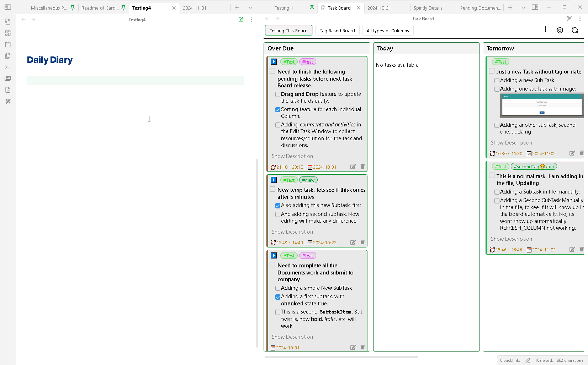

# Scanning Modes

This feature helps you to detect the files you have modified and then scan them automatically to extract any newly added tasks or the existing tasks which you have edited.

This feature can be used in three different modes, which can be controlled using the settings option : [Scanning mode](../4_How_To/6_HowToUseGlobalSettings.md#scanning-modes).

## Balanced Mode
{: .d-inline-block }
1.9.0
{: .label .label-blue }

This is the default set by this plugin. It is designed very efficiently to scan all your latest changes automatically as well as instantly. 

In this mode, when you will make any changes to your notes, it will be registered in the plugin. But it wont be scanned instantly, to allow you to keep editing the file and avoid unnecessary constant scanning. Once you have completed all your changes and when you will going to switch your focus from that edited file to any other tab or window, only then this plugin will going to scan that registered file. 

This way, the plugin kind of waits for you to finish with your changes and efficiently scan the file only once.

## Real Time Mode
{: .d-inline-block }
1.9.0
{: .label .label-blue }

This is an powerful feature of Task Board which helps you to get the latest information of your vault tasks inside the Board. The plugin uses optimized way to scan the modified files and show the edited task content on the board.

Even though it says Real-Time, its not exactly real-time in the actual sense, because if you are editing any task inside your note, your focus will be in the editor and when you will be changing your focus from the current editor to the [Task Board View](docs/Components/Task_Board_Pane.md), only that time you would be like to see your task data getting updated with the new changes. This same idea has been used to design this feature, wherein, after you move your focus from the current editor to any other tab or even out of the Obsidian application, you data will get refreshed in the Task Board View.

This is the default behavior of this plugin and its the best approach for scanning the changes in your vault and updating them on the board in real-time with the least amount of operations and consumption of energy.

A demo can be seen in the below GIF image :

But in-case, if you like to keep everything manual and have control over the scanning part. You can use the below method.

## Manual Mode

If you like to scan the updated file manually and only refresh the board when you want. Then you can select this option in the setting.

Now, your modified files wont be scanned after you change your focus from the file you have edited or saved. To scan all your updated files, you can go on the Task Board and press the `Refresh` button. This button will scan all the files which you have edited recently and update the changes inside the board.
