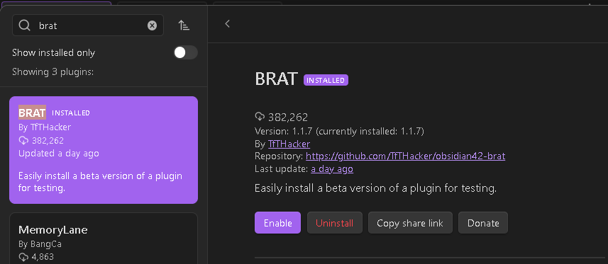
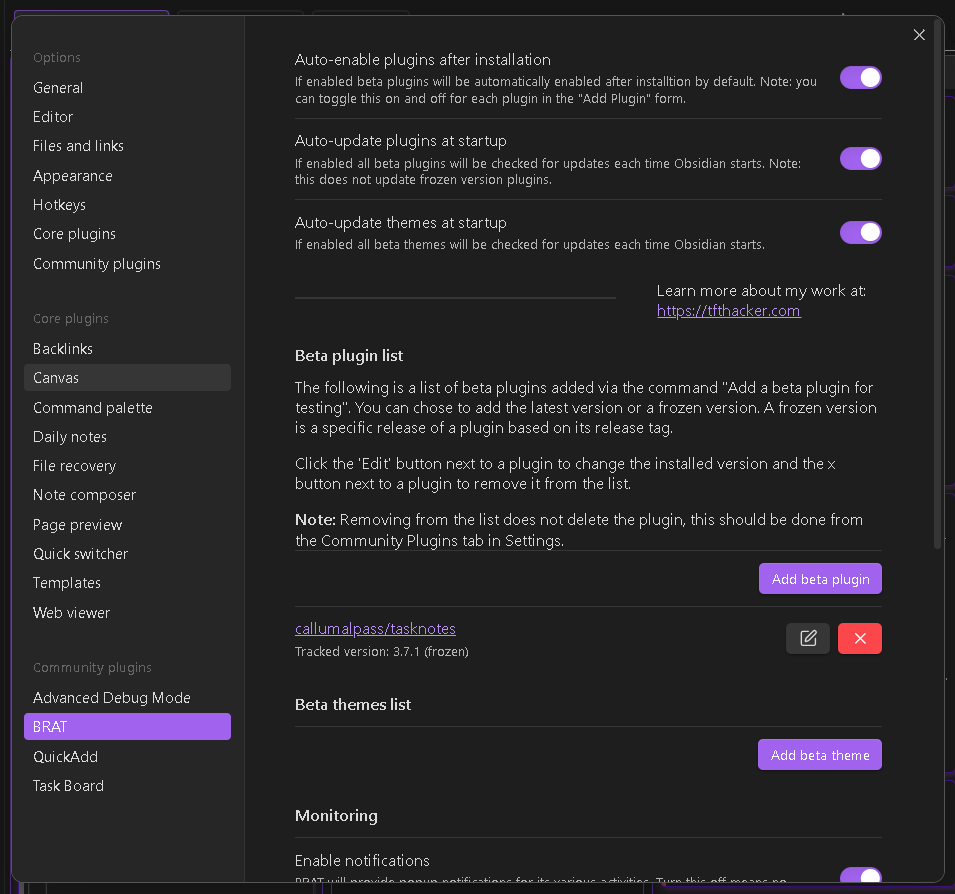
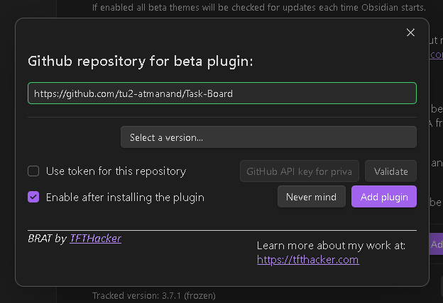

## How to test beta release

Beta releases are the versions released for testing and ensuring the plugin will work as expected after the main release. Beta version usually will have the name/tag as minor release version followed by a 'beta' name, followed by a number. Eg.: `1.5.0-beta-2`.

Whenever a new beta version has been released, you will get a notification for the same either through mail if you are watching this repository or in the Announcement section of the discussion.

There are two ways to test a beta version. (First one is easy way) : 

### Download a test vault and start testing

- In every release you will find a zip file attached which you can easily download, unzip and open inside Obsidian.
- For example, here is a test vault attached for the release of the beta version `1.8.0-beta-4` : https://github.com/tu2-atmanand/Task-Board/releases/tag/1.8.0-beta-4.
- Now, you can start testing the various new features released in this version.
- If you found any issue or bug, see if its again reproducible inside the same test vault, if yes, then zip back this test vault and [create a new issue](https://github.com/tu2-atmanand/Task-Board/issues/new) or email it to sanketgauns8@gmail.com and attach this zip file. And explain what the issue is and how to reproduce it.

### Create your own test vaul

Follow the below steps to install a beta release for testing : 

### Points to remember before installing

- Use a dummy vault or sandbox vault (for temporary testing). Since new changes might contain some bugs, there is a possibility of data loss. Hence never install a beta version of any plugin inside your main vaults.
- Uninstall any version of previous Task Board you have installed in this current vault. If this if this is your fresh new vault, then no worries.

### How to install beta version

**Step 1 :** Open the Dummy vault inside Obsidian.

**Step 2 :** Open the Settings Panel using the Gear Icon from the Side bar:

**Step 3 :** Click on the Community Plugins Tab from the Right Sidebar.

**Step 4 :** Click on the Browser button from the pane.

**Step 5 :** Search for `BRAT` in the search bar.

**Step 6 :** Click on the plugin by `TFTHacker`.

**Step 7 :** Click on **Install**.

**Step 8 :** After installing you will see a **Enable** button, click on it.

**Step 9 :** Navigate to the setting of BRAT plugin and open the tab as shown in below image :

**Step 10 :** Click on the **Add beta plugin** button. You will see a new modal as below : 

**Step 11 :** In the first input field enter the following url : `https://github.com/tu2-atmanand/Task-Board`. And then click anywhere else on the modal. You will get a green highlighting for the input field, indicating its a correct url.

**Step 12 :** Now you can select the any version of Task Board using the `"Select a version.."` drop-down menu. Select the latest beta version you want to start testing.

**Step 13 :** Simply click on the **Add plugin** button and wait for some time for the plugin to get installed.

**Step 14 :** The plugin is ready for using as usual. Try out all the new features in this version and report the bugs you will encounter. Also your suggestions are more than welcome for the enhancement of this plugin in any way.

**Thank you for you contribution!**

