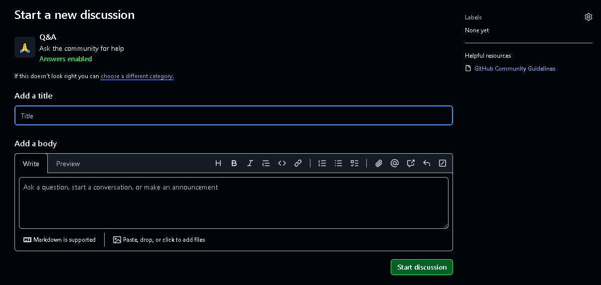

# How to use the Forum

This forum is basically the GitHub Discussion section of the Task Board repository. Any person using this plugin will be able to answer your query if the admin couldnt able to reach sooner.

## How to ask a question

**Step 1 :** Head on to this website : [Task Board Discussion - Q&A](https://github.com/tu2-atmanand/Task-Board/discussions/categories/q-a).

**Step 2 :** Click on the green button `New discussion`, which you will see in the top right corner.

**Step 3 :** You will see the following screen :

**Step 4 :** Add your question in the first field : **Add a title**. Try to keep the questoin short and one liner. You can explain/elaborate your question further inside the body section.

**Step 5 :** Elaborate your question further in the **Add a body** section. You can add images or links to documents and sites here.

**Step 6 :** Finally click on the `Start discussion` button.

> Based on the availability of community members your question will be answered shortly.
