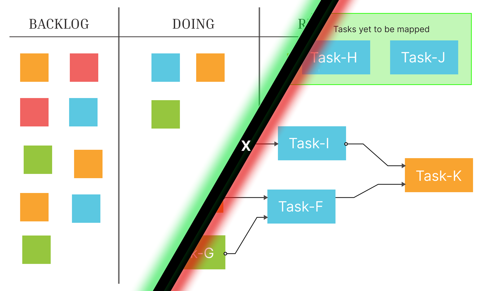

# The Power of Two: Integrating Dependency Flow Planning (DFP) with Kanban
By Atmanand Gauns
***01/10/2025***

In the dynamic world of project management, there is no single solution that fits every team or every project. While Kanban excels at visualizing workflow and managing task stages, it can sometimes lack the built-in dependency and sequential planning that complex projects demand. This is where Dependency Flow Planning (DFP) enters the picture, not as a competitor, but as a powerful, complementary tool.

By using DFP to plan the project's sequence and dependencies, and then using Kanban to manage the day-to-day execution, teams can gain the best of both worlds: a clear, logical project roadmap and a flexible, visual system for tracking progress.

## The Use Case: Building a New Mobile App Feature

Imagine a software development team tasked with building a new "Social Sharing" feature for their mobile app. The project involves multiple stages, from design to development to testing, and tasks within each stage are dependent on one another.

Here’s how the team can use DFP and Kanban together to successfully deliver the feature:

#### Step 1: The Dependency Flow Planning (DFP) Phase - Creating the Roadmap
Before anyone writes a single line of code, the team gathers to map out the project using DFP's canvas view. This is the strategic planning phase.

* **Map the Dependencies**: The team uses a large whiteboard, a physical canvas, or a digital DFP tool to visually plot all the tasks required for the new feature. They don't think about "To Do," "Doing," or "Done" yet. Instead, they focus solely on the logical flow.
	* Child Tasks: "Wireframe design," "UI/UX mockups."
	* Parent Task: "Finalized design." (The "finalized design" cannot be started until the wireframes and mockups are complete.)
	* Child Tasks: "Backend API development," "Mobile API integration."
	* Parent Task: "Frontend development" (This can be broken down into more child-tasks or sub-tasks and some of its components can be started to work on parallely but some components connected be started until the backend is ready).
* **Connect the Nodes**: Using arrows or lines, the team connects all the child tasks to their respective parent tasks. This creates a branching and sequential dependency map. The team can clearly see that certain tasks (like "UI/UX mockups") are the foundation for multiple subsequent actions. They also identify the critical path—the longest chain of dependent tasks—which is essential for estimating the project timeline.
* {Add a image here}
* **Define the "Flow"**: Through this process, the team gets a deep understanding of the project's natural sequence. They've created a living blueprint of how tasks must progress, from the initial research to the final deployment. This canvas view is the single source of truth for the project's logic and sequence.

#### Step 2: The Kanban Phase - Managing the Workflow
Once the DFP map is complete, the project transitions into the execution phase, where the team leverages the power of Kanban.

* **Set Up the Kanban Board**: The team sets up a simple Kanban board with columns representing the workflow stages:
	* **Backlog**: Tasks that are not yet started.
	* **To Do**: Tasks that are ready to be worked on.
	* **In Progress**: Tasks currently being worked on.
	* **Testing**: Tasks ready for quality assurance.
	* **Done**: Completed tasks.
* **Populate the Board Based on DFP**: The team takes the tasks from the DFP map and places them as cards on the Kanban board.
	* Initially, only the "unblocked" tasks are moved to the "To Do" column. These are the very first tasks in the dependency chain on the DFP map—the ones with no preceding child tasks. All other tasks remain in the "Backlog."
* **Work the Kanban Board, Reference the DFP Map**:
	* As a developer finishes a task (e.g., "Backend API development") and moves the card to "Done," the status of the corresponding task will be automatically updated (in a digital tool) on the DFP canvas.
	* The DFP tool will now show that the "Frontend development" parent task is now unblocked.
	* The team can now move the "Frontend development" task card from the "Backlog" to the "To Do" column on the Kanban board, making it available for a developer to pick up.

## The Synergistic Benefits

* **DFP Provides Strategic Direction**: It answers the critical question: "What's the right order to do things?" It prevents a developer from grabbing a task that is technically "ready to start" but is blocked by a dependency they aren't aware of.
* **Kanban Provides Tactical Execution**: It answers the question: "What is everyone working on right now?" and "How is our workflow performing?" The Kanban board is where the team manages their work-in-progress, identifies bottlenecks, and ensures a smooth flow of work.
* **Seamless Integration**: The two methodologies work hand-in-hand. DFP's canvas serves as the project's blueprint, while the Kanban board is the dynamic command center for execution. When a task is completed on the Kanban board, it triggers the next step on the DFP map, creating a continuous, logical loop of planning and execution.

In conclusion, combining the sequential rigor of Dependency Flow Planning with the flexible workflow management of Kanban offers a powerful and comprehensive approach to project management. Teams can use DFP to build a smart, dependency-aware project roadmap and then use Kanban to execute that roadmap with clarity, focus, and efficiency. It’s a harmonious blend of strategy and tactics, ensuring that every step taken is the right one, at the right time.
