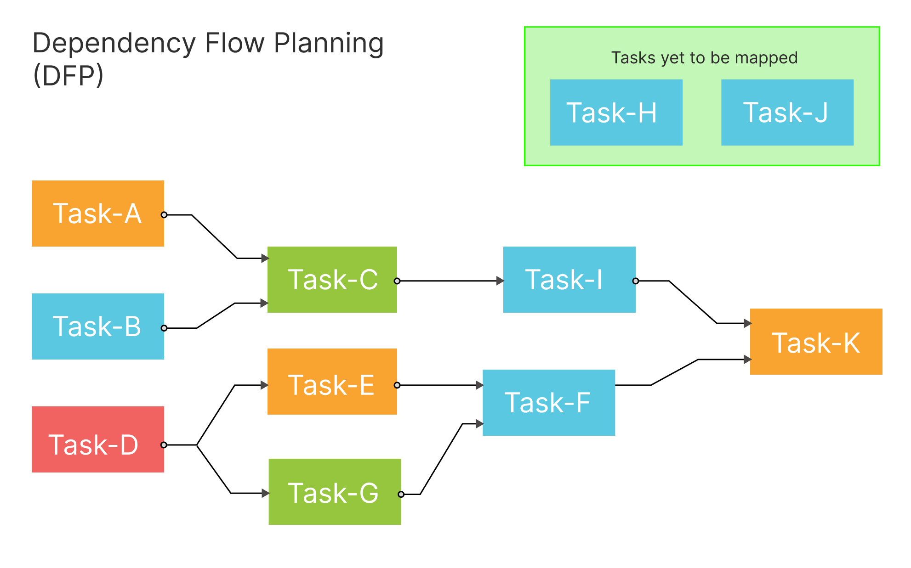
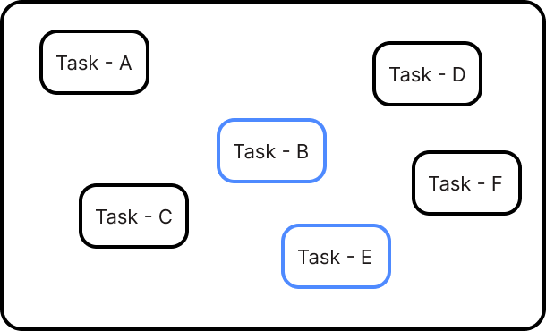
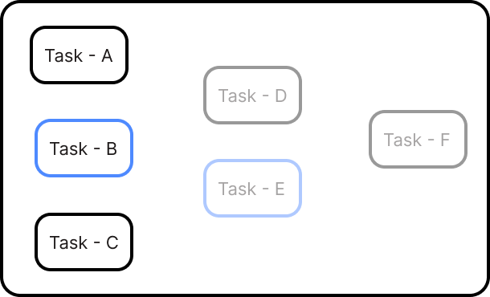
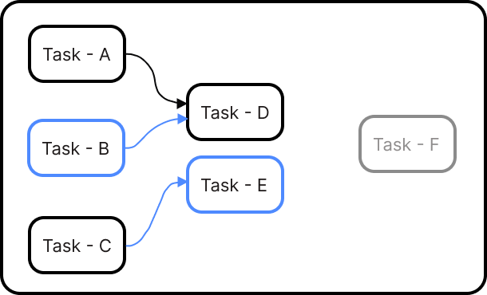
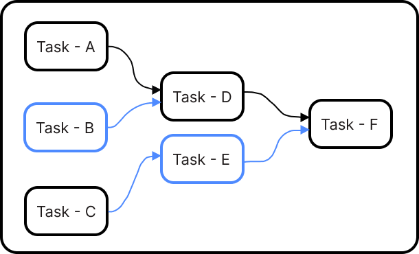
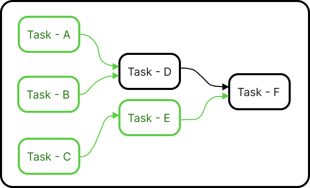

# Dependency Flow Planning (DFP) methodology 
By Atmanand Gauns
***01/10/2025***

> This is a methodology for tasks management and planning which mainly leverages the modern graphical tools such as Canvas view to easily organize, update, map and visualize the tasks on your plate.

In the world of project management, methodologies have long sought to tame complexity and bring order to chaos. From the strict hierarchies of the Work Breakdown Structure (WBS) to the fluid, continuous flow of Kanban, each approach offers a different lens through which to view and manage work. Dependency Flow Planning (DFP) draws upon the core strengths of these established systems, specifically the visual nature of mind maps and Kanban boards, and the rigorous dependency management of Gantt charts and Critical Path Method (CPM).

However, DFP introduces a fundamental shift in perspective. Instead of starting with a large goal and breaking it down, it begins with the granular, actionable tasks and uses them to define the path forward. It's a "bottom-up" approach to planning that organically builds a project map, ensuring that every step is a prerequisite for the next. This methodology is designed to be intuitive, adaptable, and focused on the practical reality of getting work done.

## The Core Principles of **DFP**

DFP operates on three core principles that distinguish it from other methodologies:
### 1. The Child-to-Parent Flow

The central tenet of DFP is the reversal of the traditional task hierarchy. In most systems, a parent task is a larger, overarching goal that is completed by finishing its child tasks. In DFP, the relationship is inverted: a parent task is the next logical stage or next action that is unlocked by the completion of one or more child tasks.

Example:
 * Child Tasks: "Write the first draft," "Edit the first draft," "Proofread the first draft."
 * Parent Task: "Submit article for publication."
In this scenario, "Submitting the article" is not a larger goal that contains the other tasks; rather, it's the specific action that can only be taken after the child tasks are finished. This creates a clear, sequential flow of work that directly reflects the natural progression of a project.

So, after the creation of all tangible tasks, this step of organizing the cards

### 2. Strict, Enforced Dependencies

DFP is built on the principle of a strict Finish-to-Start dependency. A parent task is inherently dependent on its child tasks. The system, whether a physical canvas or a digital tool, must enforce this rule. A user cannot start or mark a parent task as complete until all of its preceding child tasks are finished. This eliminates the common project management pitfall of "starting work on the next thing" before the current one is truly ready, preventing rework and wasted effort.

This dependency structure also makes it easy to identify the "critical path" of the project—the sequence of tasks that must be completed on time for the entire project to finish on schedule. By simply following the chain of dependencies from the starting point to the final deliverable, you can see the most crucial sequence of work.

Gantt charts and Critical Path Method (CPM) follows a similar approach of creating a series of tasks, but for some projects time is not that critical, rather focusing on the order of tasks and laying down the path to be followed helps to build a strong plan to complete the whole project/work.

### 3. Visual Canvas and Mapping

The third principle is the use of a visual map or canvas as the primary project interface. This is not a static document but a dynamic, evolving representation of the project's state.

 * **Task Nodes**: Each task is represented as a distinct node on the canvas.
 * **Dependency Lines**: Lines or arrows connect the child tasks to their parent tasks, visually demonstrating the flow and sequence of work.
 * **Progress Indicators**: The nodes and lines change color or appearance to show their status (e.g., green for completed, yellow for in-progress, red for blocked).

This visual mapping provides an at-a-glance overview of the entire project. Team members can easily see what they need to work on next, how their work contributes to the larger goal, and which tasks are waiting on others. The map serves as a living document of the project's journey, making it simple to track progress, identify bottlenecks, and communicate the plan to stakeholders.

## How Dependency Flow Planning Works in Practice

Here's a step-by-step breakdown of how a team would use DFP:

### 1. Define the First Tasks

Instead of starting with a grand project plan, the team identifies the very first, tangible actions that need to be taken. These are the foundational "child tasks." At this stage you are only concern about putting down the stages of tasks you will be required to complete in order to reach to the competition of the project. Moving forward these tangible tasks can be further broken down in order to assign them to different team members.

### Map the Next Stage 

Once the tasks have been arranged, the team identifies the flow, which tasks will be dependent on which of the left tasks. In the analogy of family tree, the left-most tasks is the child task, followed on its right with the parent task and it further follows with the grand-parent-task, great-grand-parent, so on...

### Iterate and Build the Map 

This process is repeated iteratively. For each new stage, you identify its own parent task—the stage that comes after it—and connect them. This creates a branching, ever-expanding map that grows organically as the project progresses. 

### Execute and Progress 

As work is done, tasks are marked as complete. As we move along the branch, we can keep our terminology dynamic to indicate the current WIP task as a child task and the next task(s) which are dependent on it as the parent task(s).  The DFP system, either a physical board or software, automatically unlocks the dependent parent task, making it available for work. Team members know exactly what to focus on next because it's the next unlocked task in the chain.

### Identify Bottlenecks 

The visual nature of the map makes it immediately obvious where work is stalled. If a group of tasks is complete, but their parent task hasn't been started, it's a clear signal that the team needs to move forward. Conversely, if a child task is not complete, its parent task will remain blocked and visibly so. In a big teams where two groups of teams have been formed, this visual board helps to identify which branch( first group) has finished it's working and now it is waiting for the other branch (second group) to complete their child task, so the parent task can be unlocked and both the groups can be merged again to continue with the upcoming task.

## Advantages of Dependency Flow Planning

* **Clarity and Simplicity**: By focusing on the direct, sequential flow of work, DFP eliminates the complexity of multi-layered, abstract hierarchies.
* **Action-Oriented**: The methodology naturally encourages a focus on what's actionable now, rather than getting bogged down in future planning.
* **Built-in Accountability**: The strict dependency rule ensures that no one can "skip ahead" or mark a task as done when its prerequisites are not met.
* **Improved Communication**: The visual map serves as a universal language for the team and stakeholders, making it easy to understand project status and dependencies at a glance.
* **Adaptability**: DFP is highly adaptable to changes. If a new task is needed, it can simply be added as a new branch or a new dependency, and the map will update accordingly.

In conclusion, Dependency Flow Planning (DFP) is more than just a new tool; it's a new mindset for project management. By shifting the focus from top-down planning to a bottom-up, sequential flow of work, it provides a simple, powerful, and intuitive way for teams to navigate complexity and achieve their goals, one step at a time.
