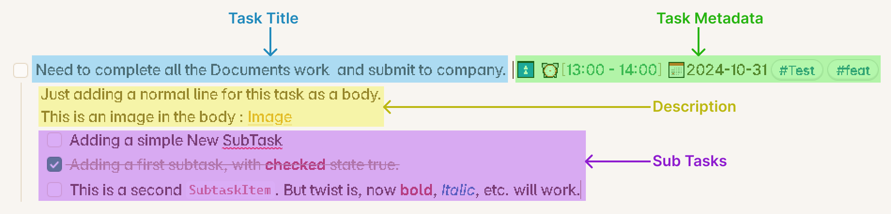
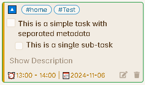
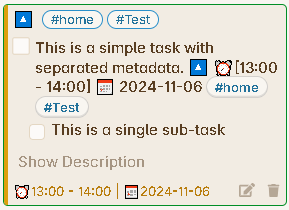

# Task Formats

This plugin only works for a specific type of tasks, which are in a particular format.

The following image will help you to understand the nomenclature to read this documentation efficiently and understand the parts of a Task.



## The Checkbox Pattern

Obsidian supports three types of pattern to create a checkbox or in other words a task item as shown below  :

```md
- [ ] 
+ [ ] 
* [ ] 
```

But this plugin only works for the first kind of checkbox or detects any line as task, if it starts with the following patter :

```md
- [ ] 
```

So, if you want the plugin to not detect any of your task and consider the task as normal text, then you can use the other types of formats. This even works for sub-task. Any sub-tasks with the patter other than supported by this plugin, will be considered as a description content for the task and will be shown under the Description section and not as a sub-task.

{: .note } Please note that, only the tasks without any indentation will be detected by this plugin. So if you say have something like below content inside your markdown file, the task wont be detected. Submit a [request](../Advanced/HowToCreateRequest.md) if you want to have this functionality.

```md
This is a simple line without any indentation or an paragraph.
    - [ ] This is a task as a part of this paragraph, with an one-level indentation.
```

## Task Title

This is the main title of any task. Most of the people would like to have a simple one liner task. It is advisable that while creating any task, give a short one line title to your task. If you want to explain what this task is about, you can add/elaborate it inside the **Description**.

## Task Metadata

These are all the properties you want to apply to the task. At present there are following properties you can apply to any task :

- Due date.
- Time duration.
- Priority.
- Tags.
- Completion time-date.

> Read more about Metadata here :[Task Metadata](./MetadataFormats.md)

**Control the Card View :** The metadata should be separated by a pipe symbol. But this is completely optional and give you an option to control how you want to see the cards inside your Task Board.

For example, if you have the following task inside your file :

```md
- [ ] This is a simple task with separated metadata | 🔼 ⏰[13:00 - 14:00] 📅 2024-11-06 #home #Test 
 This is a line inside the task description.
 - [ ] This is a single sub-task
```

Now, if you have added the pipe symbol (`|`) to separate the metadata and the task title, then your [Task Item Cards](./Task_Item_Card.md) will look like :



But if you haven't added the pipe symbol, then it will look like :



> In this case, it will be obviously a good idea to hide the header and footer, if you don't like to have them, to make the card look cleaner and to not show the same information twice.

## Task Body

The Description section and the sub-tasks combined are called the **task body**.

- Always ensure  to have atleast one-level of indentation for any line to be considered as the part of the task body.
- Also, there shouldnt be an empty line inside the task body, otherwise, the part after the empty line will be considered as a separate content even though it has an indentation. So, this criteria can be used to separate other content from the task content.

### Description

The description is basically the further elaboration of the task or even the sub tasks. You can explain as much as you want inside description, add images or attach documents. The description must be created by adding atleast one level indentation compared to the task title.

### Sub Tasks

To Create a subTasks for the main task, its is important that, there has to be atleast one Level indentation and there shouldnt be any empty lines between the task title and the sub-tasks.

You can have any number of sub-tasks and with multi-indentation. For example:

```md
- [ ] Adding a new task to show multi-level sub-tasks | 📅 2024-10-29 #Test #Bug
    - [ ] This is a First level sub-Task.
        - [ ] This is a Second level sub-task.
            - [ ] This is a Third level sub-Task.
                - [ ] This is a Fourth level sub-Task. And so on.
            - [ ] This is another Third level sub-Task.
                - [ ] This is another Fourth level sub-Task. And so on.
```

## Point to remember

- If you want to add multiple simple tasks (tasks without any task body) without leaving any empty line, then you are free to do so as shown below.

```md
- [ ] Buy a tooth-paste. | ⏫ #home
- [ ] Buy a shampoo. | #home
- [ ] Go to grocery store. | 📅2024-10-31 #home
```

The above tasks will be considered as separate task and will be shown under the columns as separate [Task Item Cards](./Task_Item_Card.md). But if say you have a task with its task body, then the next main task should be separated by an empty line.
