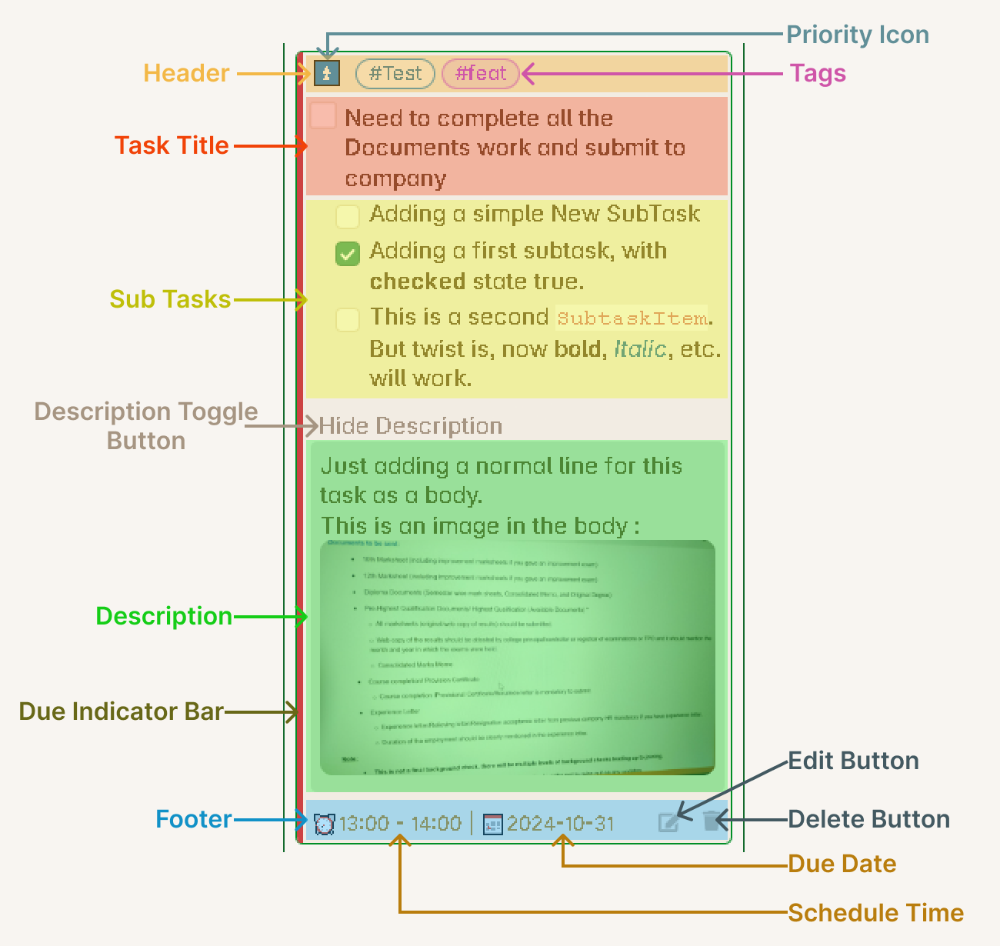

# Task Item Card

These is the card which you see inside the column under any specific board.

## Header

The Header section of this card will consists of the following things :

**1. Note Name :** (Added in v1.5.0) You can now see the name of the note where the task is located. This helps you quickly identify which file contains the task.

**2. Priority :** You will be able to see the priority of the task which you gave to this task.

**3. Tags :** All the tags you have given to this task will be show here in horizontal aligned style. Starting from v1.6.0, tasks also inherit tags from their note's frontmatter (virtual tags).

**4. Task Status :** (Added in v1.3.0) Visual indicator showing the current status of the task using custom status emojis compatible with the Tasks plugin.

**5. Card Drag Icon :** Use this to drag and drop the task between columns.

## Task Title

This is the main content of the task, the short summary. You can give any type of formatting as normally you give in markdown format.

## Sub Tasks

This section will show you all your sub-task of the main task. They will be arranged in vertical position, one below the other, as you have placed them in the markdown file, same order will be preserved. These sub-tasks will have their own checkboxes to change their status and they will be indented from the main task.

This section will also show multi-level indented sub-tasks as well in the same order, as they appear in the markdown file. The indented length will be changed based on the layout.

**New in v1.5.0:** Completed sub-tasks now display with strike-out styling for better visual distinction.

**New in v1.6.0:** You can customize whether to show or hide sub-tasks by default. When hidden, a progress bar shows the completion status of sub-tasks.

## Task Description

By default the Task Description content will be hidden. You will see a light colored text `Show Description`. This is actually a clickable text, and once you click on this text, the Description Section will expand.

The Description content is kept hidden by default is because, there can be a lot of content inside the description for the task, and keeping in visible will consume a lot of board area, which will defeat the methodology of a Kanban Board. Whenever you want to take a look at the content of the Description of any specific task, you can expand it and read the content or make use of the links from the content.

Another thing is, the content will be compressed, that, is the indentation of the content lines will be removed to save space. The idea here is to just show the content and not to worry about the formatting much, although all the other formatting will be applied like bold, italic, etc. The indentation is removed to again, show all the content in as much less area as possible. You can look at the actual content by opening the [Edit Task Window](./EditTaskWindow.md) or by directly opening the markdown file.

**New in v1.6.0:** You can customize whether to show or hide the description section by default in the settings. When hidden, you can still expand it when needed.

## Footer

The Footer section will show the following task properties :

**1. Task Start and End Time (Duration) :** There will be a clock icon followed by the start and end time of the task will be shown. From this you will be able to find out the duration of the task.

**2. Task Due Date :** After the Task Duration, you will be able to see the Due date of the task separated from the Duration value by a Pipe symbol. The Due Date will be mention using a Calender Icon before its value.

**New Task Date Properties (Added in v1.5.0):**
- **Scheduled Date:** When the task is scheduled to start
- **Start Date:** When you began working on the task
- **Created Date:** When the task was created
- **Cancelled Date:** If the task was cancelled

**3. Reminder:** (Added in v1.4.0) If you've set a reminder for the task, it will be displayed here. Works with compatible reminder plugins.

**4. Recurring Indicator:** (Added in v1.5.0) Shows if a task is set to recur using Tasks plugin syntax.

**5. Button Section :** On the far right in this section, you will able to see two main button:
- **Edit Task** button: Opens the Edit Task Window with live embedded editor (enhanced in v1.5.0)
- **Delete Task** button: Deletes the task from the board and can optionally archive it (v1.5.0)

## Additional Features

**Card Background Color** (Added in v1.4.0): Task cards can display a background color based on their tags, making it easier to visually identify and categorize tasks.

**Scroll to Task** (Added in v1.5.0): Click on a task card to scroll to its exact location in the note and highlight the first line of the task.

**Hide Metadata** (Added in v1.3.0): You can choose to hide task metadata from the task title for a cleaner look in the settings.
