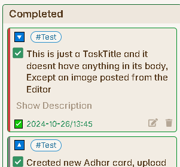

# Types of Columns

There are the following 9 types of columns you can create inside a board. Based on the properties of the columns, you will see the specific [tasks item card](./Task_Item_Card.md) in these columns under the Task Board.

## Undated

This column will contain only the tasks which do not have due date set to them.

### Properties

- **Column Name :** To create this column you only need to enter the name of the column, which will be visible on the column bar. If you want to see all the tasks, which are not been scheduled yet, then you can create this column and schedule them easily.

## Dated

This column will contain all the tasks which has a due date value. You can create a combination of **Dated** type of column, but first we need to understand the properties we have to enter to create a **Dated** column as explained below.

### Properties

- **Column Name :** The name of the column which you want to see on the Column header.

To filter tasks based on their due dates, you need to enter **two values** to set the date range:  

- ✅ **From** → The starting number of days from today of this range.
- ✅ **To** → The ending number of days from today of this range.

Remember, this values of **From** or **To** are relative-dynamic dates. Which means, today is the reference point, which is set to 0. So if you want to go in future you have to keep adding one. And if you want to go in past, keep subtracting one.

##### **Key Rule**

- If a task's **due date falls within** the selected range of days, it will be displayed.
- **No "infinity" concept** anymore. Instead, if you want to see **all future** or **all overdue** tasks, just enter a **large number** in the range.

##### **How to Set Your Date Range**

|**Goal**|**From**|**To**|**Explanation**|
|---|---|---|---|
|See **only today's** tasks|0|0|Tasks due **today** only.|
|See **yesterday's** tasks|-1|-1|Tasks due **1 day ago**.|
|See **tomorrow's** tasks|1|1|Tasks due **1 day ahead**.|
|See **next 7 days**|1|7|Tasks due from **tomorrow to the next 7 days**.|
|See **past 7 days** (overdue)|-7|-1|Tasks due **in the last 7 days but not today**.|
|See **all future tasks**|1|300|Tasks due **from tomorrow up to 300 days ahead**.|
|See **all overdue tasks**|-300|-1|Tasks due **in the last 300 days but not today**.|
|See **all tasks (past & future)**|-300|300|Tasks from **past 300 days to the next 300 days**.|

---

##### **Examples**

**Example 1: Filtering Today's Tasks**

📌 **You enter:**

- **From = 0**
- **To = 0**

✅ **Shows tasks due today only.**

---

**Example 2: Filtering Tasks Due in the Next 3 Days**

📌 **You enter:**

- **From = 1**
- **To = 3**

✅ **Shows tasks due tomorrow, day after tomorrow, and 3 days from now.**

---

**Example 3: Filtering All Overdue Tasks**

📌 **You enter:**

- **From = -300**
- **To = -1**

✅ **Shows tasks that were due in the past 300 days (excluding today).**

---

**Example 4: Filtering All Future Tasks**

📌 **You enter:**

- **From = 1**
- **To = 300**

✅ **Shows tasks that are due from tomorrow onwards, up to 300 days ahead.**

{: .note }
> Observe that, while entering 0 in the input field, it keeps the field empty, thats a normal behavior in obsidian and it will work as expected, simply type the zero.

## Tagged

Also known as `namedTagged`. This column will contain all the tasks which has been tagged with the specific tag name you have added in the property of this column.

### Properties

- **Column Name :** The first property will be as usual the name of the column which you want to see on the column header.
- **Tag Name :** This is the name of the tag, which you will going to give for multiple tasks in your vault. For example, if you are giving a tag as `#bug` to many tasks, and you want to see all this tasks under one column, then this is the type of column for you. You will have to enter the value `bug` for this input field.

## Untagged

Intuitively, this column will show you all the tasks, which has not been provided by any tag. If you would like to see all the un-tagged tasks, so that you can assign them tags later, which will be much easier from the [Edit Task Window](./EditTaskWindow.md), then you can create this column.

### Properties

- **Column Name :** The only property for this type of column is the name of the column.

## Other Tags

Now, after you have understood what are **Untagged** and **Tagged** column, there might be case, where you have given a tag to many tasks and you haven't created a **Tagged** type of column for this tasks, then these tasks wont be shown on the board at all, since they also do not fall under the **Untagged** column type criteria. For all these tasks, you can create a **Other Tags** type of column, to show all this tasks under this column

### Properties

- **Column Name :** The only property for this type of column is the name of the column.

## Completed

This type of column will show you all the tasks, which has been marked as completed. So, you will notice that, all the task item card under this column will have a different fields inside their Footer. Since you have marked the task as complete, you will see the time-date value when you marked this task as complete as can be seen from the below image.

### Properties

- **Column Name :** The first property will be as usual the name of the column which you want to see on the column header.
- **Max Items :** This is a number value you want to enter to set a limit to the number of task item cards you want to see under this column. This has been kept to limit the number of tasks rendered under this column, because over a time, you might complete lot of tasks, and if you haven't deleted these tasks from you vault, then they will be getting appended under this column and will increase the load time of the board, hence setting a limit will help you to show only the latest completed tasks.

## Status

This type of column was added in version 1.5.0 and allows you to filter tasks based on their task status. This is particularly useful if you use custom task statuses (similar to the [Tasks plugin](https://publish.obsidian.md/tasks/Getting+Started/Statuses/About+Statuses)) to track different states like "In Progress", "Waiting", "Blocked", etc.

### Properties

- **Column Name :** The name of the column which you want to see on the column header.
- **Status :** The status value you want to filter tasks by. Tasks with this specific status will appear in this column.

## Priority

This type of column was added in version 1.5.0 and allows you to filter tasks based on their priority level. This helps you organize tasks by importance and focus on high-priority items.

### Properties

- **Column Name :** The name of the column which you want to see on the column header.
- **Priority :** Select the priority level you want to filter by (e.g., High, Medium, Low). Tasks with this priority will appear in this column.

## Path

This type of column was added in version 1.6.0 and allows you to filter tasks from a specific file or note. This is extremely useful when you want to create a dedicated column for tasks from a particular project file or daily note.

### Properties

- **Column Name :** The name of the column which you want to see on the column header.
- **File Path :** The path to the specific file from which you want to display tasks. Use the file suggester to easily select the file from your vault.

{: .note }
> The Path filtered column is perfect for project-specific boards where you want to see tasks from a single important file alongside other tasks.
