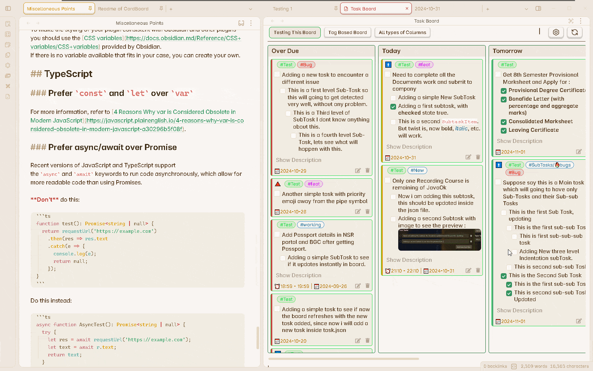

# Editing existing task

There are two ways to edit the old content of your task.

The obvious method is directly editing from the markdown file, explained in detail here : [Edit Task from File](../How_To/HowToEditATask.md#from-the-markdown-file).

But using the [Task Editor](../Components/EditTaskWindow.md), you can easily edit the task without opening the parent markdown file.

## How to use the window

This features allows you to directly edit the content of the tasks from the board. You don't have to open the parent markdown file of this task to edit it. The changes will be reflected in the markdown file.

**Enhanced in v1.5.0:** The Task Editor now includes a **Live Embedded Editor** for real-time editing with preview.

**Step 1 :** Click on the Edit Icon button to open the **Task Editor**. The button is visible when you hover over the task card (v1.1.0).

**Step 2 :** Now Edit any field you want from the specific input field. You can also add values to the empty fields, add description or add more sub-tasks.

**Step 3 :** Remember to press save button after you have made the changes.

**New in v1.3.0:** A confirmation popup will appear if you accidentally try to close the modal without saving your changes.

> Understand all the features of this window from here : [Task Editor](../Components/EditTaskWindow.md)

## Live Editing Features
{: .d-inline-block }
v1.5.0
{: .label .label-blue }

The Task Editor now provides:

- **Live Embedded Editor**: See changes in real-time as you type
- **Dual View**: Switch between raw editor and live preview
- **Tag Suggester**: Easily add tags with autocomplete
- **Syntax Highlighting**: Better visibility of task properties
- **Real-time Validation**: Immediate feedback on task format

## Safe Editing
{: .d-inline-block }
v1.6.0
{: .label .label-blue }

**Content Safety**: Task Board now includes a safeguard feature that performs proper content matching before updating your files. A Content Compare modal shows you the changes before they are applied, ensuring you never lose content accidentally.

## Edit Button Modes
{: .d-inline-block }
v1.1.0
{: .label .label-blue }

You can configure what happens when you click the edit button:
- Open the Task Editor (default)
- Open the note in a new tab
- Open the note in the current tab
- Show hover preview
- Other navigation options

## Scroll to Task
{: .d-inline-block }
v1.5.0
{: .label .label-blue }

When you click on a task, Task Board will scroll to the exact location of the task in the note and highlight the first line, making it easy to find and edit tasks in large files.
