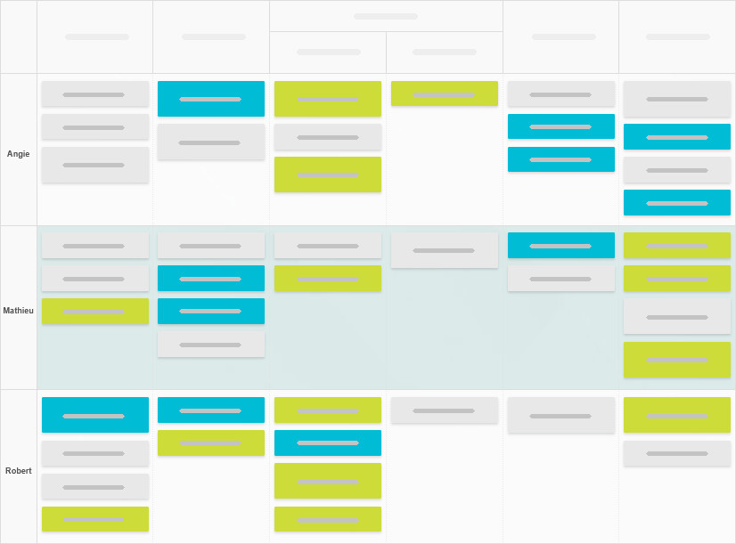

# Kanban Swimlanes
{: .d-inline-block }

v1.10.0
{: .label .label-purple }

Kanban Swimlanes is a part of Kanban methodology which helps to group together similar tasks within the columns. Because of this grouping, it creates horizontal divisions on a Kanban board which then can be used to categorize and organize tasks based on specific criteria such as team, project, priority, or workflow stage.  They add a second layer of visual organization beyond the vertical columns (like "To Do," "In Progress," "Done") by grouping related work items into distinct lanes. 

This structure enhances workflow clarity, helps teams manage workloads, prioritize tasks, and identify bottlenecks more effectively. Swimlanes are especially useful in complex projects involving multiple teams, clients, or types of work, as they reduce visual clutter and improve focus.

Below is an image, which shows how you may group tasks which are assigned to specific member in your team.

## Why this feature is unique?

There are multiple plugins and even softwares out there which has the swimlanes feature in them. Kanban swimlanes is basically a feature which allows you to group together similar tasks based on their various properties. This creates horizontal lanes similar to the vertical column. So, the whole Kanban board divides itself into a 2D array.
But the specific configurations which makes this Kanban swimlanes feature in Task Board unique are :
- **Custom sorting**
- **Aggregator swimlane**

---

### Custom sorting

In Task Board, while creating swimlanes for your specific board, you can sort them in the order you would like. For example, if you have created swimlanes based on the tag property of tasks. But the sorting of the swimlanes should not be based only ascending or descending, and you want something more. Then you have the option to create as many swimlanes as you like and order them however you want.

### Aggregator Swimlane

Now, in this same example of creating swimlanes using the tag property. There will be often a situation where you will prefer to have only few swimlanes, say only 3 swimlanes, and rest all the tasks with different tags on them should be group into one single swimlane, as an aggregator. For this, you can enable this option so you only see a single "Aggregated Swimlane" at the bottom.
Read this GitHub ticket to learn more : https://github.com/tu2-atmanand/Task-Board/issues/592