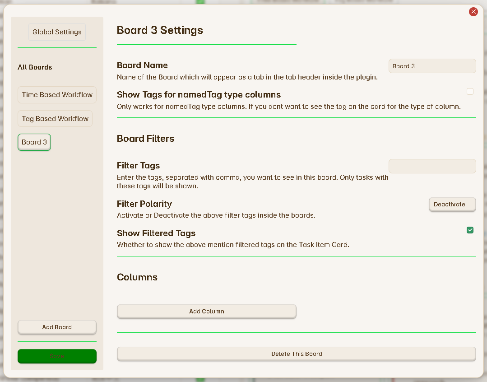

# Add a new Column

If you have created a fresh new board you board configuration will look like following :

**Step 1 :** Click on the `Add Column` button you can see inside the **Columns** section.

**Step 2 :** Once you press on this button, a pop will appear as shown below :

**Step 3 :** This pop-up will ask you to select the type of the new column and the name of this new column. You can add any name as you want which will be visible inside the Task Board View Header. If you dont know about the column types, learn more about them from here and add the columns according to your board : [Types of Columns](../Components/Types_Of_Columns.md).

**Step 4 :** Click on `Submit` button once you have filled the required options.

**Step 5 :** You new colmn will appear inside your board. you can choose to add more different types of columns as you need inside the board.

> Remember to click on the save button, to save your new changes.
