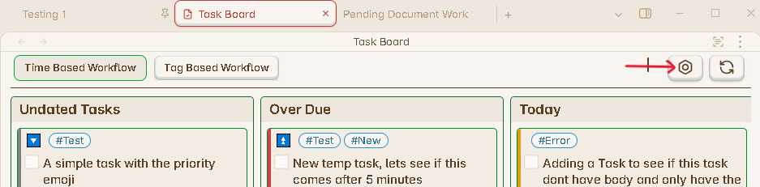

# How to create a new Board

This section will explain you how to create a new board inside the [Task Board View](../Components/Task_Board_Pane.md#active-board-section) and what are the benefits of creating multiple boards to track your tasks efficiently.

## Creating a New Board

**Step 1 :** Click on the `Configure Board Button` from the top right corner inside the Task Board View as shown below :

**Step 2 :** Now you will see the `Add Board` button at the bottom from the left sidebar in the current opened window. Click on this button.

**Step 3 :** This will add a new board with the name `Board #`, where `#` will be the number of your board in the list. Click on this new board from the left sidebar as shown below :

**Step 4 :** Now you can edit the properties of this board like Board Name, Board Filters and adding columns to this board.

> For a fresh new board, it will be empty by default, you have to add columns into it as per your choice. Go through this page to understand which types of column you need to add : [Adding New Columns](./HowToAddNewColumn.md)

**Step 5 :** Once you are done with your changes, click on the `Save` button from the left side bar.

**Step 6 :** You might need to click on the `Refresh Board` button if you changes haven't been reflected automatically.

## Advantages of New Boards

There are various advantages of having multiple types of board instead of just one and using sorting options of individual columns or the whole board again and again to track your tasks properly.

Multiple boards gives you following advantages :

- Helps to segregate your tasks in multiple views.
- Easily switch between different board view, to see only specific tasks.
- Apply filters on the whole board and filter out only related task to the project.
