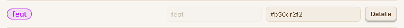

# How to use the Global Settings

This settings will be applied on all boards and is a global settings for the plugin.

### Filters for Scanning

This section contains three different types of filters you can apply while your vault is getting scanned for tasks. The first two filters are for scanning files and all the files inside the folder. The third filter is to scan task which contains any one fo the tag you have mentioned in the input field.

If you are using only one of this filter at a time and keeping the other two disabled, then its very simple to understand, but if you are using combinations of all the filters, then a proper understanding is required to understand how to use them or how it works. To understand all this things and also how to enter the values. please read this section carefully : [Filters for Scanning](../Features/Filters_for_Scanning.md)

### Real-time scanning

| Input Field   | Default Value |
|---------------|---------------|
| Toggle Button | ON            |

This toggle input fields helps you to enable or disable the [Real-Time Scanning Feature](../Features/Auto_Scanning_Files.md#real-time-scanning). Go through the page to understand the feature properly. By default this is been kept ON, because, its the most efficient way to make use of this plugin.

### Default note for adding new tasks

### File for archived tasks

### Tasks cache file path

### Open board on Obsidian startup

| Input Field   | Default Value |
|---------------|---------------|
| Toggle Button | OFF            |

This setting will help you to get your Task Board visible to you on Obsidian startup. When you open and close Obsidian, if you want Task Board to be the first thing visible inside the Obsidian, you can enable this feature.

### Auto-scan the vault on Obsidian start-up

| Input Field   | Default Value |
|---------------|---------------|
| Toggle Button | OFF           |

This option will help you to decide whether you want to scan all your files or filtered files every time when the Obsidian starts. The Vault-Scanning feature can be understood from here : [Vault-Scanning](../Features/Scan_Vault_Feature.md).

This can be a beneficial feature for those who edit their files outside of Obsidian, so when Obsidian opens, Task Board is unaware that the tasks has been updated from various files, in this case you will be required to run the [Scan Vault](../Features/Scan_Vault_Feature.md) feature manually, so you can set this option to ON, to scan all the files automatically whenever Obsidian starts.

{: .warning } 
>Do not enable this feature if you vault is very big and contains lot of large files with lot of data. This feature will work the best if you have set the file and folder [Scanning Filters](../Features/Filters_for_Scanning.md).

### Update language translation

| Input Field   | Default Value |
|---------------|---------------|
| Click Button | NA           |

You may see this is a simple click button. This button simply downloads the latest language translation file for your selected language in Obsidian general setting and place it inside the plugin's config folder. Even you can edit this file to make instant changes. Read this : [Update language translation strings](../Advanced/Contribution_For_Languages.md#how-to-update-existing-language-content)

> Note : Obsidian reload is required after downloading the new updates. You can use the "Reload without saving command".

## Board UI Settings

These are all the settings which deals with the UI part of the Task Board.

### Show Header of the Task Item Card

| Input Field   | Default Value |
|---------------|---------------|
| Toggle Button | ON            |

This is a toggle input field, which allows you to show or hide the Header section of the Task Item Card inside the Task Board. If you have set this to false/disable, you wont able to see the priority and tags or the task.

### Show Footer of the Task Item Card

| Input Field   | Default Value |
|---------------|---------------|
| Toggle Button | ON            |

This is a toggle input field, which allows you to show or hide the Footer section of the Task Item Card inside the Task Board. If you have set this to false/disable, you wont able to see the Time, Due date and the Edit and Delete button.

- In this case of hidden footer, double click on the Task Item Card to open the [Edit Task window](../Components/EditTaskWindow.md). From this window you will be able to delete the task.

> You can use this and the previous setting option, if you are not making use of this fiels for a task and you want a distraction free, minimalistic experience to manage your tasks and keep them simple.

### Show task without metadata
{: .d-inline-block }

New (v1.3.0)
{: .label .label-green }

| Input Field   | Default Value |
|---------------|---------------|
| Toggle Button | ON            |

This setting will help you to see the tast title inside the Task Item card without any metadata(properties) to get a clean view of your tasks.

You can use this setting along with above two settings to get 4 different looks for your board.

### Width of each Column

| Input Field | Default Value |
|-------------|---------------|
| Text Input  | 273px         |

Using this field, you can able to control the width of each column. If you like to have wider Task Item Cards, use a bigger value inside the input field in pixels. You can try using different values to match your need. Remember to enter a 'px' and the end after the value.

### Show Column Scroll Bar

| Input Field   | Default Value |
|---------------|---------------|
| Toggle Button | OFF           |

If you like to see the scrollbar for each column, to know, how length your specific column is or to keep reminding yourself how many tasks it contains, you can enable this feature. But Enabling it, will take a small amount of width from every column, to which a scroll bar is applicable.

## Tag Colors

This section will allow you to assign your unique custom colors to the specific tags you want. This feature is very helpful if you have multiple tags assigned to a single task. It help to visually see the task item card appealing.

If you have already added a custom tag, then it will look like below :

- **Preview :** On the left most there will be the preview of how your tag will look like in the [header of the task item card](../Components/Task_Item_Card.md#header).
- **Tag Name :** Next you will see the name of the tag. As of now, once you add the tag, its not editable, but soon, it will be editable.
- **Custom Tag Color :** Next there will be an input field, in which you can enter the value of the color in RGBA Hex format.
- **Delete Button :** Lastly there will be a delete button, using which you can delete that specific color, so that tag will take the default color/theme from your current Obsidian theme.

**Add tag color :** Below all the custom colors, you will see the button to add more new custom colors for your other tags. You can add as many tag-colors as you want. Once you press the button, you will be asked to enter the name of the tag, then the to enter the color, there will be first a color palette for you to choose the color easily. And thirdly there will be an input field, for you to enter the opacity of the color since the color pallette do not supports the opacity option. Enter the value for the opacity from 0 to 1, in fractions, like 0.4, etc.

## Automation

Following settings deals with the automation features supported by this plugin.

### Edit button mode

| Input Field | Dropdown Options                                                                                                                          | Default Value                |
| ----------- | ----------------------------------------------------------------------------------------------------------------------------------------- | ---------------------------- |
| Dropdown    | Use edit task window feature Open note in new tab Open note in right split Open note in new window Open note in hover preview | Use edit task window feature |

### Auto add due date to tasks

| Input Field   | Default Value |
|---------------|---------------|
| Toggle Button | ON            |

This option help you add due date automatically if you havent entered any value for the due input field inside the [Add/Edit Task Window](../Components/EditTaskWindow.md). This feature only works when you are adding a new task using the Window provided by this plugin.

{: .note }
> When you will be editing a task and if the task do not have any due date set to it, this feature will auto-assign today's date as a due date to that task. So keep this in mind if you have enabled this feature. If you do not want this functionality, you can disable this.

## Compatibility for other plugins

Task Board supports compatibility options, so that it can work with other plugins seamlessly. This helps the developer and the users, so that we don't re-build the wheel, instead use what is already existing, which also gives lot of freedom to the users to use Obsidian efficiently.

### Day planner plugin compatibility

| Input Field   | Default Value |
|---------------|---------------|
| Toggle Button | OFF           |

[Day Planner plugin](obsidian://show-plugin?id=obsidian-day-planner) is an amazing plugin because of its timeline feature and calender feature. You can easily make changes from the this plugin and the changes will be reflected back to the Task Board. Also, once you set time to your plugins, it will be shown inside the timeline. Enable or disable this feature if you have installed the plugin.

### Daily Notes plugin compatibility

| Input Field   | Default Value |
|---------------|---------------|
| Toggle Button | ON            |

Daily notes is a core plugin, using which you create daily notes. Since the files you create have a name like a date, for example if your today's file is `2024-11-1.md`, then you can use this feature for considering all the tasks under this file which do not have a due date set to them in their metadata to schedule for today itself. That is inside the [Task Item Card](../Components/Task_Item_Card.md) you will see that the tasks under the daily note file, will be given the due date as per the name of that file, even if you haven't provided or forgot to provide a due date for it. This is very helpful since, its obvious that, if you have added any task under today daily file, then that file has been due for today. If you do not like this functionality, you can disable this feature, in which case you will be required to set the due date yourself, either from the Edit Task Window or manually, using plugins like [Tasks](obsidian://show-plugin?id=obsidian-tasks-plugin).

## Due and completion date formats

### Preview Section

This is a small section, where you will see, how your task will look like based on the configurations you have set, for example, if you change the values of the below options, you will see the format of you tasks will change accordingly. To see all the compatible formats this plugin supports, click here : [Metadata Formats](../Components/MetadataFormats.md).

### Compatible plugins

| Input Field | Dropdown Options                                              | Default Value |
| ----------- | ------------------------------------------------------------- | ------------- |
| Dropdown    | Default Tasks plugin Dataview plugin Obsidian Native | Default       |

This option will let you select, which pattern/format you follow for setting the metadata to your tasks, for example, if you are using Tasks plugin, then you may select this value for this setting, in which case, you will get emojis for the due and completion. But if you are using other plugin formats like [Dataview Plugin](obsidian://show-plugin?id=dataview), then the format will be a little different. Go through this page, to know how the different filed values look inside the markdown based on the value of this setting : [Metadata Formats](../Components/MetadataFormats.md).

### Due date format

| Input Field | Default Value |
|-------------|---------------|
| Text Input  | yyyy-MM-DD    |

This field, will help you to enter your specific pattern for the date you prefer to see inside all your markdown files. Keeping the format global helps all the plugins work properly and blend well with the core Obsidian.

{: .warning }
> Remember to follow the same pattern which you are using for the Daily note files for the [Daily Notes plugin compatibility](#daily-notes-plugin-compatibility) setting work properly.

### Task completion date-time pattern

| Input Field | Default Value    |
|-------------|------------------|
| Text Input  | yyyy-MM-DD/HH:mm |

This setting option will help you to set, the format of the time-date value which you would like to see when you mark your tasks complete. This value will be shown inside the [Footer of the Task Item Card](../Components/Task_Item_Card.md#footer), when they are inside [Completed column](../Components/Types_Of_Columns.md#completed).

### First day of the week
{: .d-inline-block }

Not implemented
{: .label .label-yellow }

| Input Field | Default Value |
|-------------|---------------|
| Dropdown    | Mon           |

This is an **optional** settings for now, which will be used in future for better compatibility with other plugins and for upcoming features in Task Board.

### Task Completion in local time
{: .d-inline-block }

Not implemented
{: .label .label-yellow }

| Input Field   | Default Value |
|---------------|---------------|
| Toggle Button | ON            |

### Show UTC offset for task completion
{: .d-inline-block }

Not implemented
{: .label .label-yellow }

| Input Field   | Default Value |
|---------------|---------------|
| Toggle Button | OFF           |

## Donation Section

This section contains button-links to my various sponsorship sites. If you have like this plugin and would like to support the further development of this idea and to improve it, consider supporting my work by sponsoring this project using any site you want.
