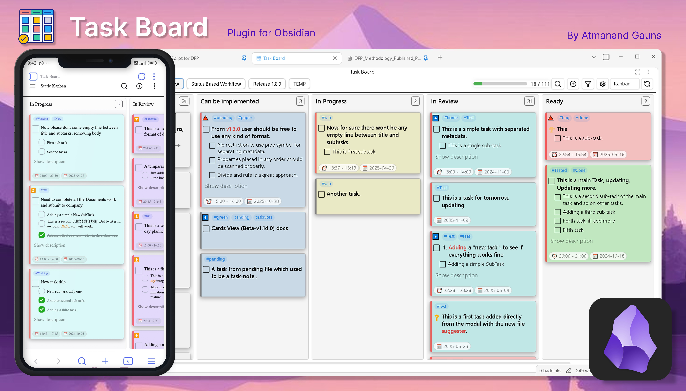

# **Task Board**

**"Document your progress while completing your tasks"**

[Get started now](#how-to-start){: .btn .btn-primary .fs-5 .mb-4 .mb-md-0 .mr-2 .mx-auto }
[View it on GitHub](https://github.com/tu2-atmanand/Task-Board){: .btn .fs-5 .mb-4 .mb-md-0 .mx-auto }

## Topics

- [01 - Installation](./docs/Installation.md)
- [02 - Getting Started](./docs/Getting_Started.md)
- [03 - Features](./docs/Features/index.md)
- [04 - Components](./docs/Components/index.md)
- [05 - Examples](./docs/Examples/index.md)
- [06 - How to do Anything](./docs/How_To/index.md)
- [07 - FAQs](./docs/FAQs/index.md)

## **What is Task Board**

[**Task Board**](https://github.com/tu2-atmanand/Task-Board) is a plugin for [Obsidian](https://obsidian.md/) to view and manage all your task in a much more efficient Kanban board format. Easily manage your tasks throughout your vault from a single place. And automate your task management workflow.

<iframe width="560" height="315" src="https://www.youtube.com/embed/videoseries?si=47oadLEUQuuzUuRV&amp;list=PLqEPxsDi1dtepfcaUO9r1BTGZN6IuhvvH" title="YouTube video player" frameborder="0" allow="accelerometer; autoplay; clipboard-write; encrypted-media; gyroscope; picture-in-picture; web-share" referrerpolicy="strict-origin-when-cross-origin" allowfullscreen></iframe>

Watch the above complete YouTube playlist to see demo of all the features released in every version.

## How Does it work

- This plugin scans tasks from all markdown files across your entire vault and shows them in a Kanban type board.
- [Scan filters](./docs/Features/Filters_for_Scanning.md) can be applied to scan only specific files or to exclude specific files.
- You can edit the task directly from the **Task Board**, without opening the Markdown file.
- Add tasks to currently opened files using a pop-up window.

## How to start

**STEP 1:** Install the plugin: [Installation](./docs/Installation.md)

**STEP 2:** Learn about the basics: [Getting Started](./docs/Getting_Started.md)

**STEP 3:** Explore the [Features](./docs/Features/index.md) of the plugin as well as [UI Components](./docs/Components/index.md).

**STEP 4:** Explore [Examples](./docs/Examples/index.md) for ideas and quick answers.

{: .new-title }
> Important
>
> Questions? Start here: [Task Board FAQs](./docs/How_To/index.md)
>
> If you would like to contribute to this project or the docs, start here: [How to Contribute](./docs/Advanced/index.md)

## Motivation and Vision

Previously, I always used the [Kanban Plugin](https://github.com/mgmeyers/obsidian-kanban) to manage my tasks. It had many amazing features and worked nicely for me, but as soon as I came across the [CardBoard plugin](obsidian://show-plugin?id=card-board) everything changed. The idea of being able to manage from one spot tasks from anywhere in my vault amazed me. After experimenting with the CardBoard plugin for a while, I quickly switched. However, after I used it for few days, I realized there were some important features it was lacking. I had some challenges with contributing to their main project, so I instead decided to start my own plugin.

While in development, I took inspiration from the CardBoard and Kanban plugins, as well as many feature ideas from [GitHub project planning KanBan board](https://docs.github.com/en/issues/planning-and-tracking-with-projects/customizing-views-in-your-project/changing-the-layout-of-a-view#about-the-board-layout). It is my hope that I am able to give the best of all three plugins in one place, as well as take improvements even further.

If you would like to understand **Task Board**'s vision and future development roadmap, check here: [Vision of Task Board](./docs/Vision.md).

## Support

A great deal of effort has gone into bringing this idea to life. While the plugin was originally created for my personal use, I genuinely believed it could help others streamline their task management and project handling.

If you’ve found this plugin helpful and it has made your work easier, please consider supporting its development through a donation. Your contribution will help ensure continuous improvements and the addition of new features.

  

## License

**Task Board** is licensed under GNU GPL V2. Refer to [LICENSE](https://github.com/tu2-atmanand/Task-Board/blob/main/LICENSE) for more information.
